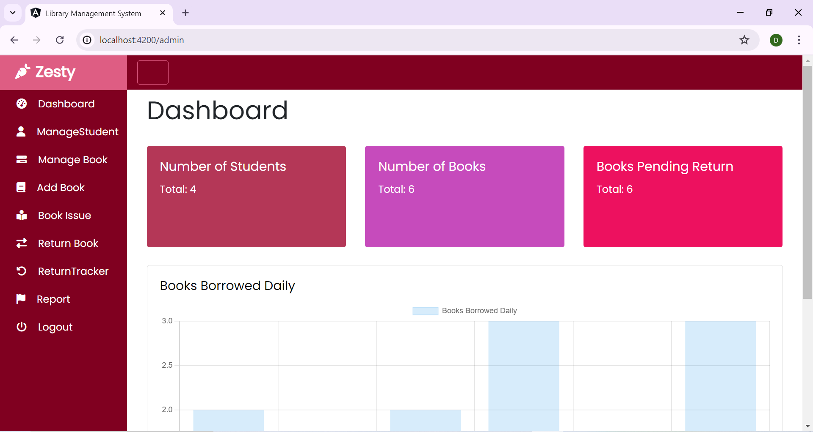
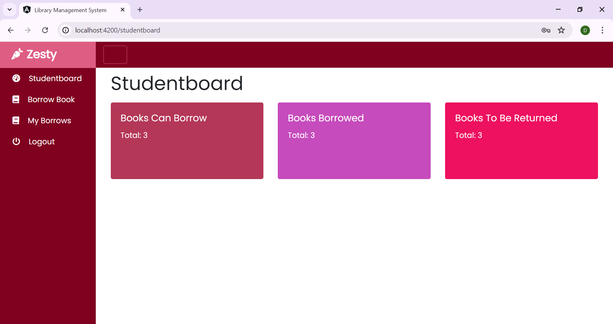

# LibraryManagement_Syatem
Angular and Web API controllers (C#)

Welcome to the Library Management System project! This repository contains both the frontend (Angular UI) and backend (Web API) components of the Library Management System.

## Project Structure

The project is structured into two main folders:

- `LibraryManagementUI`: Angular serving as frontend for the Library Management System.
- `LibraryManagementAPI`: Web API controllers serving as the backend for the Library Management System.

  ## Getting Started

  To get started with this project, follow these steps:

  ### Prerequisites

  Make sure you have the following installed:

  - **Frontend (Angular UI):**
  - Node.js and npm
  - Visual Studio Code (IDE)

- **Backend (Web API):**
  - Visual Studio 2019 (IDE)
  - .NET SDK
  - ASP.NET Web Application (.NET Framework)

### Cloning the Repository

```bash
git clone https://github.com/your-username/LibraryManagement_System.git
cd LibraryManagement_System

Setup Frontend (Angular UI)

- open cmd in LibraryManagementUI
>> cd LibraryManagementUI
>> npm install
>> ng serve

Navigate to http://localhost:4200/ in your browser to view the Angular UI.

Additional Angular Packages
Install the following packages in the LibraryManagementUI folder:

- open cmd in LibraryManagementUI
npm install jquery --save
npm install @types/jquery --save-dev

npm install html2canvas --save
npm install @types/html2canvas --save-dev

npm install uuid
npm install @types/uuid --save-dev

npm install chart.js ng2-charts --save

npm install jspdf @types/jspdf --save

Setup Backend (Web API)

- open the LibraryManagementAPI folder inside the Visual Studio 2019

Backend Configuration
> The backend uses ASP.NET Web Application (.NET Framework) with no HTTPS configured.

> Install the following NuGet packages in Visual Studio for backend:
    * Serilog.AspNetCore
    * Microsoft.AspNet.WebApi.Cors
After installing the packages, add the following line in WebApiConfig.cs:
   -- config.EnableCors(new EnableCorsAttribute("*", "*", "*"));

## Screenshots

### 1. Home Page![Homepage]


### 2. Admin Dasdboard




### 3. Student UI




Contributing

Feel free t contribute to this peoject by forking the repository and submitting a pull request. Any improvements or bug fixes are welocome!
